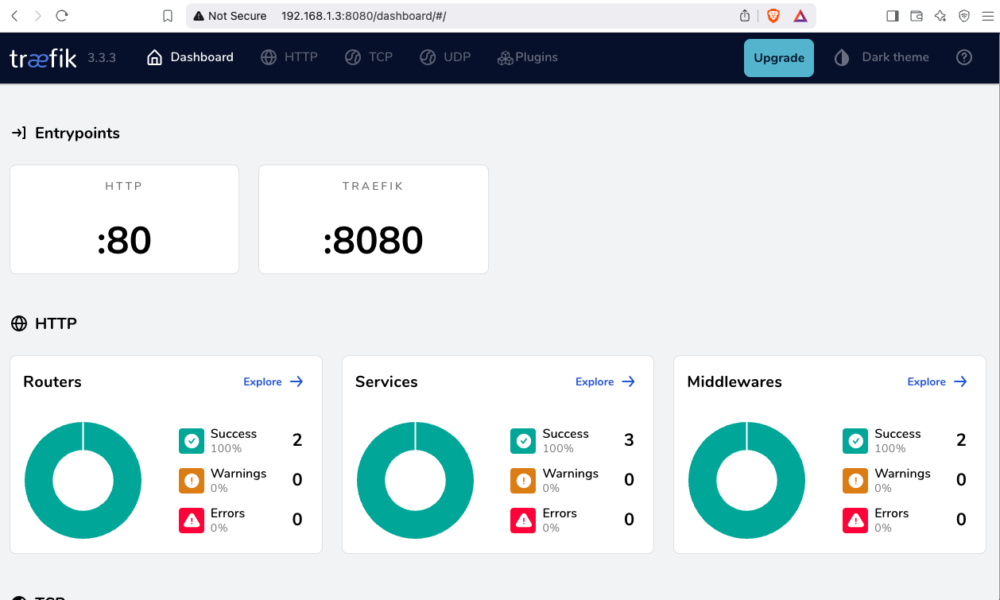

# Introduction to Traefik

a blog post series about my homelab.


check here for [Introduction to Traefik - Part Two](https://github.com/ebal/traefik-intro-02)

## Part One aka Introduction

In this blog post, I’ll walk you through the process of setting up Traefik as a reverse proxy for your homelab. [Traefik](https://doc.traefik.io/traefik/) is a cloud-native an open-source reverse proxy and load balancer.

My homelab involves using a virtual machine connected via a point-to-point VPN to a cloud VPS, along with several docker containers for various tasks and learning purposes. The goal is to expose only Traefik to the internet, which will then provide access to my internal homelab. I also use Tailscale, to avoid exposing my linux machine directly to the internet, so no SSH port is open on the firewall. So, in conclusion, I have a complex homelab setup, which I frequently destroy and recreate for educational purposes.

I have made a short video to accompany this blog post:
[](https://youtu.be/t0mFq_94QtA)

## docker compose

To begin, we need to set up a basic [Docker Compose](https://docs.docker.com/compose/) YAML file.

As of the time of writing this blog post, the latest Traefik Docker container image is version 3.3. It is best to declare a specific version instead of using "latest" tag.

```yaml
image: traefik:v3.3
```

Using an **default.env** file in a Docker Compose configuration is important for several reasons, as for configure variables, secrets and it is easy to reuse though several services and to avoid hardcoding values. For traefik is important so we can configure the docker GID in order traefik to be able to use the docker socket.

eg. **default.env**

```bash
UMASK="002"
TZ="Europe/Athens"
DNS="88.198.92.222"
```

Next interesting topic is the volumes section.

I would like to mount a local directory for the traefik configuration, which I will later use with the dynamic file provider. Additionally, to enable Traefik to recognize our (future) docker images, we need to mount the docker socket too.

```yaml
    volumes:
        # The configuration directory for traefik
      - ./traefik:/etc/traefik
        # So that Traefik can listen to other Docker Containers
      - /var/run/docker.sock:/var/run/docker.sock:ro
```

to conclude, here is a very basic docker compose yaml file:

**docker-compose.yml**

```yaml
---
services:
  traefik:
    image: traefik:v3.3
    container_name: traefik
    hostname: traefik
    env_file:
      - path: ./default.env
        required: true
    restart: unless-stopped
    ports:
      # The Web UI (enabled by --api.insecure=true)
      - 8080:8080
      # The HTTP port
      - 80:80
    volumes:
        # The configuration directory for traefik
      - ./traefik:/etc/traefik
        # So that Traefik can listen to other Docker Containers
      - /var/run/docker.sock:/var/run/docker.sock:ro

```

## pull traefik docker image

we can explicitly get the Traefik docker container image

```bash
docker compose pull traefik
```

## traefik configuration file

we also need to create the configuration file by enabling the API and the dashboard for now.

Create the directory and file

`traefik/traefik.yml`

and write this:

```yaml
# API and dashboard configuration
api:
insecure: true
```

## Start traefik docker

We are ready start and run our Traefik docker container:

```bash
docker compose up
```

result is something like:

```
[+] Running 2/2
✔ Network homelab_default Created 0.3s
✔ Container traefik Created 0.4s
Attaching to traefik
```

To stop traefik from docker compose, we need to open a new terminal and type from the same directory

```bash
docker compose down
```

or we can run the docker compose and detach it, so it runs on the background:

```bash
docker compose up traefik -d
```

This is going to be useful for the future as we starting each service one by one.

## Test traefik

Open your browser and click on: http://127.0.0.1:8080

you will see something like:


